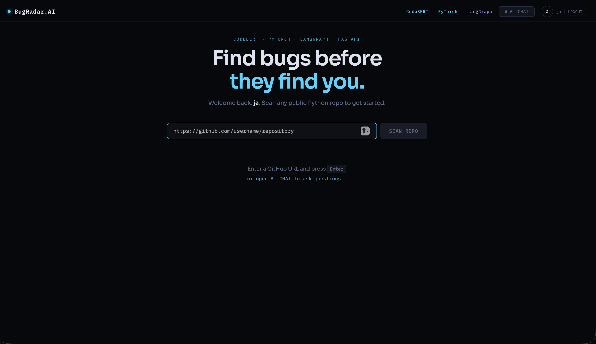
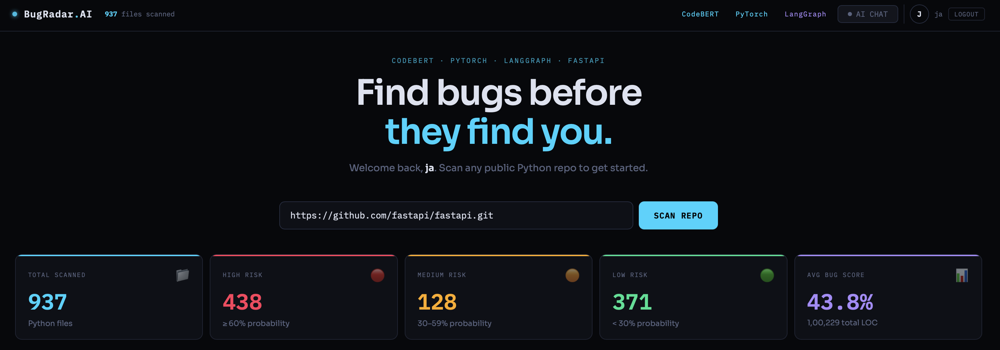
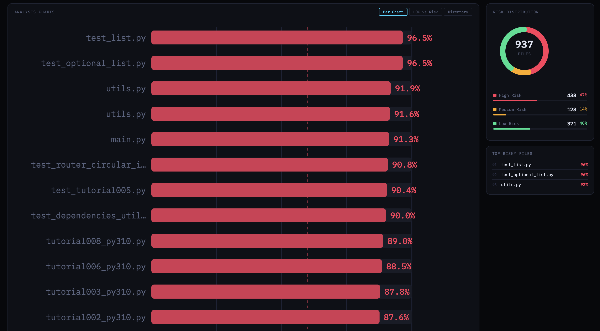
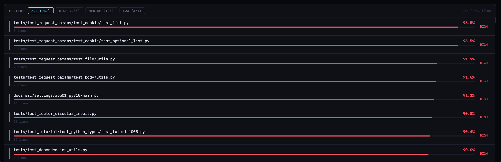

# 🔬 BugRadar AI

> Scan any public Python repository. **CodeBERT + PyTorch** scores every file by bug probability. A **5-step LangGraph agent** then explains what's wrong, fixes the code, and writes unit tests.


---

## 📸 Demo

> Scanned the real **FastAPI** repository — 937 Python files, 100,229 lines of code.

### Landing Page


### Scan Results — Risk Overview


### Risk Heatmap & Distribution


### Full File Risk Table


---

## 🔢 Real Results — FastAPI Repository

| Metric | Value |
|--------|-------|
| Total files scanned | **937** |
| High risk files (≥ 60%) | **438** (47%) |
| Medium risk files (30–59%) | **128** (14%) |
| Low risk files (< 30%) | **371** (40%) |
| Average bug probability | **43.8%** |
| Total lines of code analyzed | **1,00,229** |
| Top risky file | `test_list.py` — **96.5%** |

---

## 🏗️ How It Works

```
GitHub Repo URL
      │
      ▼
┌─────────────────────┐
│   github_utils.py   │  ← shallow git clone, extract all .py files
└─────────────────────┘
      │
      ▼
┌─────────────────────────────────────────────┐
│                ml_model.py                  │
│                                             │
│  CodeBERT (microsoft/codebert-base)         │
│  → 768-dim CLS embedding per file           │
│                                             │
│  Radon → LOC + avg cyclomatic complexity    │
│  → 2 tabular features (StandardScaler)      │
│                                             │
│  BugClassifier (PyTorch, 770→512→256→1)     │
│  BatchNorm + Dropout → sigmoid → bug %      │
└─────────────────────────────────────────────┘
      │  (files flagged as high risk)
      ▼
┌─────────────────────────────────────────────┐
│              llm_retriwer.py                │
│         (LangGraph 5-node agent)            │
│                                             │
│  Node 1: Hypothesize  → bug category guess  │
│  Node 2: Critique     → specific issues     │
│  Node 3: Fix          → corrected code      │
│  Node 4: Tests        → pytest cases        │
│  Node 5: Report       → full markdown       │
└─────────────────────────────────────────────┘
      │
      ▼
┌─────────────────────┐
│     FastAPI         │  ← REST API with JWT auth
│     main.py         │
└─────────────────────┘
      │
      ▼
┌─────────────────────┐
│  React Frontend     │  ← Bar chart, LOC scatter, Directory heatmap
└─────────────────────┘
```

---

## ✨ Features

- 🔐 **JWT Authentication** — Signup/login with bcrypt password hashing and 24-hour token expiry
- 🤖 **CodeBERT Embeddings** — Microsoft's code-pretrained RoBERTa for deep semantic file understanding
- 🧠 **Custom PyTorch Model** — BugClassifier (770→512→256→1) trained on 45,301 real code samples
- 🔗 **LangGraph Agent** — 5-node sequential graph: Hypothesize → Critique → Fix → Tests → Report
- 📊 **3 Chart Types** — Bar chart, LOC vs Risk scatter plot, Directory heatmap
- 🔴🟡🟢 **Risk Filtering** — Filter ALL / HIGH / MEDIUM / LOW with live file counts
- ⚡ **FastAPI Backend** — Async, fully typed, with CORS middleware and Depends injection
- 🗂️ **Repo-level Analysis** — Handles 1000+ file repos with shallow git clone for speed

---

## 🧠 Model Details

| Component | Detail |
|-----------|--------|
| Base model | `microsoft/codebert-base` (RoBERTa) |
| Embedding dim | 768 (CLS token) + 2 tabular = **770-dim input** |
| Architecture | MLP: 770 → 512 → 256 → 1 |
| Regularization | BatchNorm + Dropout (0.3) at each layer |
| Training data | 45,301 code samples, 1.6:1 class ratio |
| Accuracy | ~80–85% |
| F1 Score | ~0.72–0.78 |
| Tabular features | LOC + average cyclomatic complexity (Radon) |

---

## 📁 Project Structure

```
project/
├── backend/
│   ├── main.py           # FastAPI routes (/analyze, /review, /auth/*)
│   ├── ml_model.py       # CodeBERT + PyTorch inference pipeline
│   ├── github_utils.py   # Shallow git clone + .py file extraction
│   ├── llm_retriwer.py   # LangGraph 5-node agent
│   └── auth.py           # JWT signup/login with bcrypt
├── frontend/
│   ├── app.py            # Streamlit UI
│   └── react/            # React frontend (no build step)
├── models/               # Trained weights — NOT committed to git
│   ├── best_bug_model.pth
│   └── scaler.pkl
├── assets/
│   └── screenshots/      # Demo screenshots
└── requirements.txt
```

---

## 🚀 Local Setup

### 1. Clone the repo
```bash
git clone https://github.com/JaishKumar0/bugradar-ai.git
cd bugradar-ai
```

### 2. Install dependencies
```bash
pip install -r requirements.txt
```

### 3. Set environment variables
Create a `.env` file in the root:
```env
HUGGINGFACEHUB_API_TOKEN=your_hf_token_here
JWT_SECRET_KEY=your_secret_key_here
```

> Get your free HuggingFace token at: https://huggingface.co/settings/tokens

### 4. Add model weights
Place your trained model files in the `models/` folder:
```
models/
├── best_bug_model.pth
└── scaler.pkl
```

### 5. Run the backend
```bash
cd backend
uvicorn main:app --reload
```
Backend runs at `http://localhost:8000`

### 6. Run the frontend

**React (full UI):**
Open `frontend/react/index.html` directly in your browser.

**Streamlit (simple):**
```bash
cd frontend
streamlit run app.py
```

---


### Example: Analyze a repo
```bash
curl -X POST http://localhost:8000/analyze \
  -H "Authorization: Bearer YOUR_JWT_TOKEN" \
  -H "Content-Type: application/json" \
  -d '{"url": "https://github.com/tiangolo/fastapi"}'
```

---

## 🔮 LangGraph Agent — Node Breakdown

```
Hypothesize → Critique → Fix → Tests → Report
```

| Node | Input | Output |
|------|-------|--------|
| **Hypothesize** | File name + first 1500 chars + bug % | Bug category guess (3 bullets) |
| **Critique** | Full code + hypothesis | Up to 5 specific issues with line numbers |
| **Fix** | Full code + critique | Corrected Python code block |
| **Tests** | Critique | 3 pytest test cases with assert statements |
| **Report** | All above | Full markdown report with risk badge |

---

## 👤 Author

**Jaish Kumar** — Final Year B.Tech Computer Science, Bundelkhand University

[](https://www.linkedin.com/in/jaish-kumar)
[](https://github.com/JaishKumar0)

